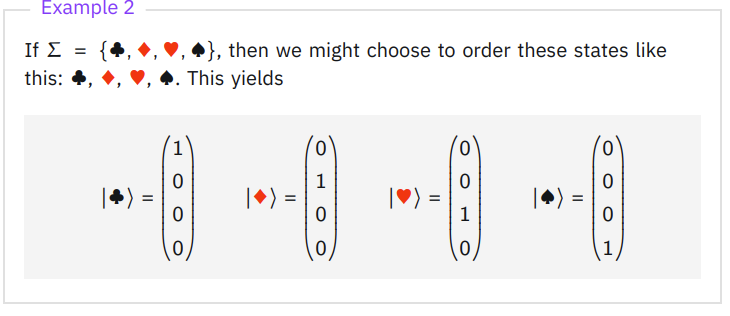

## Saved Resources
[Why are quantum state vectors complex and not real?](https://academic.oup.com/book/8209/chapter/153756525?login=true)

[what does it mean to be a quantum algorithm](https://www.scientificamerican.com/article/the-limits-of-quantum-computers/)

## Foreword
Computing in simple terms is the transformation of information in a controllned manner that can yeild a usefull final state. Such an example, would be logic circuit to add two numbers. 

# Classical Information

## Notation

- $X$: Denotes a system
- $\Sigma$: Denotes the set of classical states system $X$ can take on.

## Classical State

In computer science terms, a state is simply a string that is tied to a unique setting of the information in a system. When considering a system $X$, there are instances where our knowledge [^knowledge] of $X$ insists on a concrete belief about the system, and therefore we can assert its classical state.

### Classical State Example: Fan

We observe the fan to be spinning. The knowledge of it spinning lets us formulate the belief that it is in the 'ON' state.

However, we can imagine that if a box was placed over the fan, we would no longer be able to extrapolate concrete information about the system.

## Probabilistic State

In cases where our knowledge of $X$ is uncertain, its state is best described probabilistically:

> "We represent our knowledge of the classical state of $X$ by assigning probabilities to each classical state." \
> \
> ― IBM Quantum Learning [^IBM]

To put it another way: 'Probabilistic state' is a vehicle for reasoning about the state of a system in the presence of uncertainty.

## Definition: Probability Vector
:::{.note .blue}
|     |
| --- |
| ℹ️ The convention is to give each state a probability in vector form. This is called the probability vector. Consider the following example. |
:::

## Probabilistic State Example: Weather

Consider the weather system [^Naming]. Our knowledge of tomorrow's weather forecast is probabilistic and not certain [^Conceptualize].

Let $\Sigma$ be the different states for tomorrow's forecast $X$. Our knowledge of the state of $X$ is described probabilistically:

$$\left(
\begin{array}{c}
  \text{'sunny'} \\
  \text{'rainy'}
\end{array} 
\right) = 
\left(
\begin{array}{c}
  .6 \\
  .4 \\
\end{array}
\right)$$

The probability vector represents our beliefs about tomorrow's forecast. i.e., we believe tomorrow's weather is sunny with probability .6 and rainy with probability .4.

## Measuring probabilistic states

The state of the weather tomorrow is uncertain until we observe it. Once observed, our knowledge is complete, and we can be certain about the value of the state. Observations that update our knowledge are referred to as 'measurements'.

> "Measurement (observation) changes our knowledge of the system, and therefore changes the probabilistic state that we associate with that system" [^IBM].

## Classical Operations

Let $f$ be a function defined as:
$$f: \Sigma \rightarrow \Sigma $$
$f$ is referred to as a **classical operation**. Classical operations transform. any classical state $a \in \Sigma$ into $f(a)$, with $f(a) \in \Sigma$

To review, a classical system, $X$, is a medium that stores information. At any particular instance, the current information stored in $X$ corresponds to its current state $\sigma \in \Sigma$.

The current value of the information stored in a system can be changed via operations that act upon the system. Such operations are referred to as *deterministic operations*. We can think of deterministic operations as next state functions in finite state machines: On input of the current state $\sigma \in \Sigma$, deterministic operation $f$ returns the next state.

## Dirac Notation - Ket

**Motivation:**  
Consider a system $X$ with a set of states denoted as $\Sigma$. To facilitate linear algebra operations, it's advantageous to represent an arbitrary state $a \in \Sigma$ as a vector - this is done with 'ket' in *Dirac Notation*.

**Ket:**
We can represent a state as a column vector using ket notation. As we will see, this expresses the probability vector (and other things) in a much more concise manner.

$|a\rangle$, known as 'ket a', is a column vector with a one at the position corresponding to $a$'s index in $\Sigma$.

Once expressed as a column vector, the probability vector can then be represented as a linear combination with the probabilities for each state acting as weights.

$$
\left(
\begin{array}{c}
  .6 \\
  .4 \\
\end{array}
\right) = .6 \times |0\rangle + .4 \times |1\rangle$$

### bra
The second way to represent a state is with bra notation. Bra notation is a row vector with a 1 in the entry corresponding to a particular state. We denote by ⟨a∣ the row vector having a 1 in the entry corresponding to 'a' and zero for all other entries, for each 'a' in the set Σ.

  

## Quantum States

To reiterate, classical systems define operations that transform one state to another. The invention of the logic circuit allows these transformations to be represented in real life, thus enabling practical computation. Obviously, the scope of operations is defined within the bounds of what can be represented in reality. For instance, a deterministic operation that defines a NOT operation is valid since we can create this in reality with a NOT gate. However, there may be other convenient operations or transformations that can be derived in theory but not in practical reality.

Such is the case with quantum computing -- at least for now. The nature of quantum systems, unlike classical systems, allows one to derive operations that are unlike classical operations, but they cannot be represented with traditional logic circuits.

### What is quantum state?

Quantum state 

### Quantum State Vector
Quantum state vector properties are:

1. All entries are complex values.
2. The sum of absolute values squared is equal to one.

###  

<!-- SideNotes -->
[^Naming]:
  {-} Weather condition is the system $X$ and the type of weather, sunny or rainy, are the states $\Sigma$.

[^IBM]: 
  [IBM Quantum Learning](https://learning.quantum.ibm.com/course/basics-of-quantum-information/single-systems).

[^Conceptualize]:
  {-} One way to conceptualize: Tomorrow acts as our metaphorical box that hides concrete information from us -- it is not until we can observe the weather the next day that we can update our belief to be 100 percent.

[^knowledge]:
  Knowledge is the understanding or information that an observer has about a system -- it is external to it. The knowledge of a system lets one talk about its state -- it lets one formulate a belief about the system.
